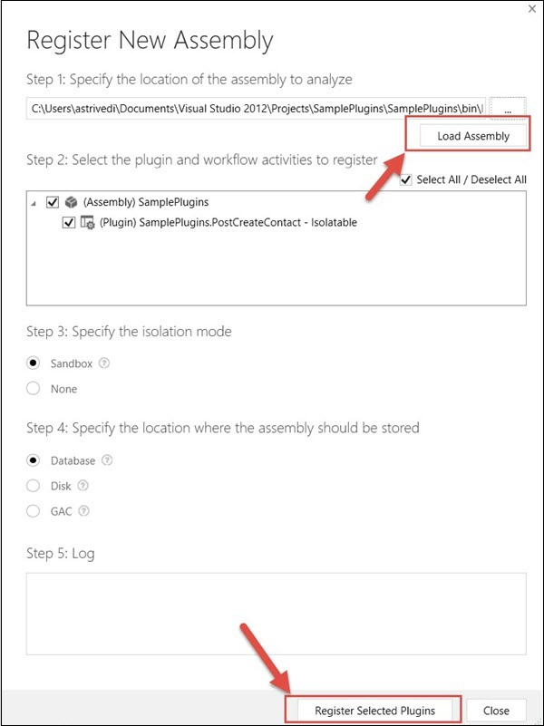

# Plugin Registration

In the last chapter, we created a sample plugin to create a follow-up Task activity when a Contact record is created. In this chapter, we will see how to register this plugin in CRM using Plugin Registration Tool. You can find the tool at this location: SDK/Tools/PluginRegistration/PluginRegistration.exe.

For convenience, the plugin registration process is divided into three sections −

*   Connecting to the Server
*   Registering the Assembly
*   Registering the Plugin

Connecting to the Server
------------------------

**Step 1** − Run the **PluginRegistration.exe** from the location specified earlier. Click the Create New Connection button.

**Step 2** − In the Login window, choose Office 365 since we are using the online version of CRM. Enter your credentials and click Login.

**Step 3** − The tool will open and look like the following screenshot.

Registering the Assembly
------------------------

**Step 1** − Go to Register → Register New Assembly.

**Step 2** − This will open the Register New Assembly window. Click the Navigate icon and locate the Plugin DLL that you created in the last chapter.

**Step 3** − After navigating the DLL, click Load Assembly. This will populate the SamplePlugins assembly and all its plugin classes. You can see the **PostCreateContact** plugin class highlighted below. If your plugin assembly had 3 plugin classes, it would have shown three plugins listed there.

**Step 4** − Select Isolation Mode as Sandbox, Location as Database and click Register Selected Plugins. It will show you a success message, if the registration is successful.

Registering the Plugin
----------------------

Now we will be registering the specific steps on which the individual plugins will be called.

**Step 1** − Select the PostCreateContact plugin.

**Step 2** − Click Register → Register New Step.

**Step 3** − We will be registering this plugin on the creation of the Contact entity, on postoperation stage and in the synchronous mode.

**Message** − Create

**Primary Entity** − Contact

**Event Pipeline Stage of Execution** − Post-operation

**Execution Mode** − Synchronous

Keep the rest of the options by default and click Register New Step.

You can see a new step added to the plugin.

Now we will go to CRM and test if our plugin is working correctly. Note that these test steps are specific to our example plugin.

Testing the Plugin
------------------

Go to Contacts tab and create a new record. Once you save the record, you can see a new activity created and associated with this record.

You can click the activity to see the details that we had set in the code.

This confirms that our plugin ran successfully. Similarly, you can extend your plugins to achieve highly complex functionalities.

[Previous Page](./Plugins.md)  [Next Page](./Web%20Services.md) 