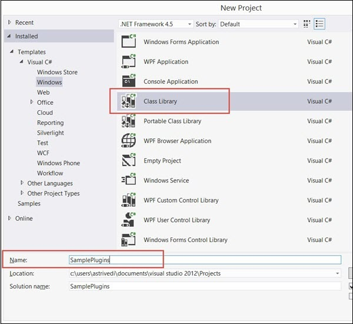
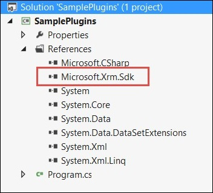
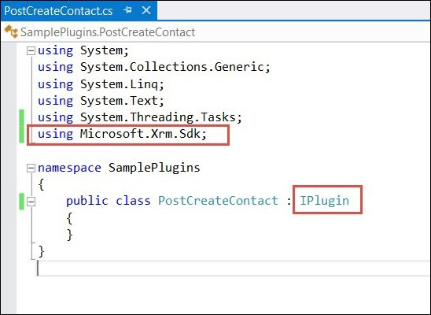
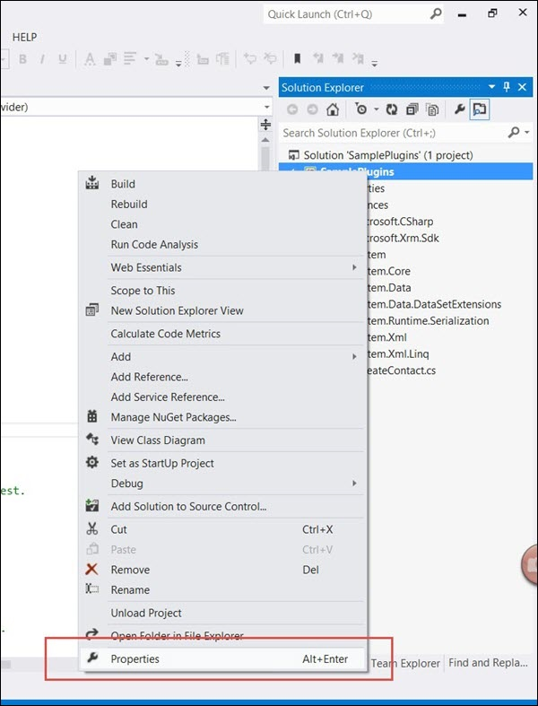
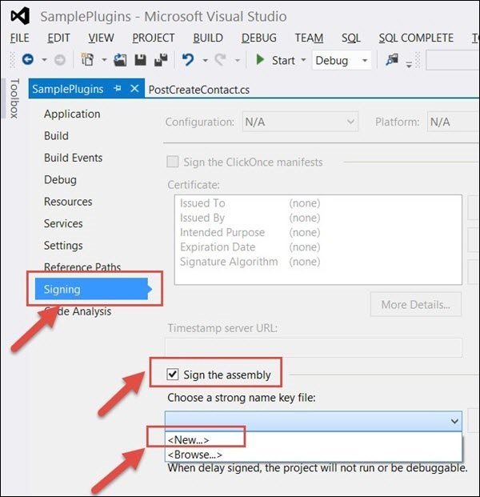
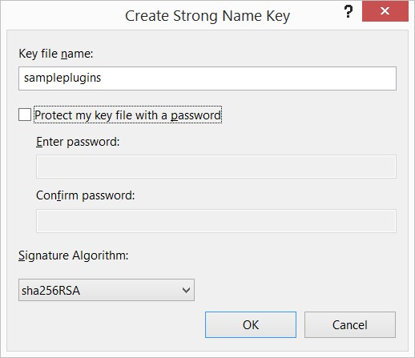

 

Microsoft Dynamics CRM - Plugins
================================

A plug-in is a custom business logic that integrates with Microsoft Dynamics CRM to modify or extend the standard behavior of the platform. Plug-ins act as event handlers and are registered to execute on a particular event in CRM. Plugins are written in either C# or VB and can run either in synchronous or asynchronous mode.

Some scenarios where you would write a plugin are −

*   You want to execute some business logic such as updating certain fields of a record or updating related records, etc. when you create or update a CRM record.
    
*   You want to call an external web service on certain events such as saving or updating a record.
    
*   You want to dynamically calculate the field values when any record is opened.
    
*   You want to automate processes such as sending e-mails to your customers on certain events in CRM.
    

Event Framework
---------------

The Event Processing Framework in CRM processes the synchronous and asynchronous plugin requests by passing it to the event execution pipeline. Whenever an event triggers a plugin logic, a message is sent to the CRM Organization Web Service where it can be read or modified by other plugins or any core operations of the platform.

Plugin Pipeline Stages
----------------------

The entire plugin pipeline is divided in multiple stages on which you can register your custom business logic. The pipeline stage specified indicates at which stage of the plugin execution cycle, your plugin code runs. Out of all the specified pipeline stages in the following table, you can register your custom plugins only on Pre- and Post-events. You can’t register plugins on Platform Core Main Operations.

Plugins can be triggered by:

* A user action in the Dynamics 365 user interface, such as retrieving a record
* Events triggered by the Organization Service or the WebAPI, such as retrieving a record

Post-Operation events in the pipeline are processed either:

* synchronously – these plugins are are executed immediately and run in a specific order
* asynchronously – these plugins are executed by the Queue Agent and run later by the async service
Other events are processed synchronously.

The event pipeline is as following:

| Event| Stage Name | Stage Number | Sync/Async | Description |
|-------|-----------|---------------|------------|------------|
| Pre-Event | Pre-validation | 10 | Sync | Stage in the pipeline for plug-ins that are to execute before the main system operation. Plug-ins registered in this stage may execute outside the database transaction. |
| Pre-Event| Pre-operation | 20 | Sync | Stage in the pipeline for plug-ins that are to executed before the main system operation. Plugins registered in this stage are executed within the database transaction. |
|Platform Core Operation | MainOperation | 30 | | Intransaction,the main operation of the system, such as create, update, delete, and so on. No custom plug-ins can be registered in this stage. For internal use only.
|Post-Event|Post-operation| 40 | Sync & Async| Stage in the pipeline for plug-ins which are to executed after the main operation. Plug-ins registered in this stage are executed within the database transaction.

Plug-ins that execute during the database transaction and pass an exception back to the platform cancel the core operation.

Whenever the CRM application invokes an event (like saving or updating a record), the following sequence of actions takes place −

*   The event triggers a Web service call and the execution is passed through the event pipeline stages (pre-event, platform core operations, post-event).
    
*   The information is internally packaged as an OrganizationRequest message and finally sent to the internal CRM Web service methods and platform core operations.
    
*   The OrganizationRequest message is first received by pre-event plugins, which can modify the information before passing it to platform core operations. After the platform core operations, the message is packaged as OrganizationResponse and passed to the post-operation plugins. The postoperations plugins can optionally modify this information before passing it to the async plugin.
    
*   The plugins receive this information in the form of context object that is passed to the Execute method after which the further processing happens.
    
*   After all the plugin processing completes, the execution is passed back to the application which triggered the event.
    

Plugin Messages
---------------

Messages are the events on which the plugin (or business logic) is registered. For example, you can register a plugin on Create Message of Contact entity. This would fire the business logic whenever a new Contact record is created.

For custom entities, following are the supported messages based on whether the entity is user-owned or organization-owned.

| Message Name | Ownership Type |
|--------------|----------------|
| Assign       | User-owned entities only |
|Create|User-owned and organization-owned entities |
| Delete | User-owned and organization-owned entities |
| GrantAccess | User-owned entities only |
| ModifyAccess | User-owned entities only |
| Retrieve | User-owned and organization-owned entities |
| RetrieveMultiple | User-owned and organization-owned entities |
| RetrievePrincipalAccess | User-owned entities only |
| RetrieveSharedPrincipalsAndAccess | User-owned entities only |
| RevokeAccess | User-owned entities only |
| SetState | User-owned and organization-owned entities |
| SetStateDynamicEntity | User-owned and organization-owned entities |
| Update | User-owned and organization-owned entities |

For default out-of-the-box entities, there are more than 100 supported messages. Some of these messages are applicable for all the entities while some of them are specific to certain entities. You can find the complete list of supported message in an excel file inside the SDK: **SDK\\Message-entity support for plug-ins.xlsx**

Writing Plugin
--------------

In this section, we will learn the basics of writing a plugin. We will be creating a sample plugin that creates a Task activity to follow-up with the customer whenever a new customer is added to the system, i.e. whenever a new Contactrecord is created in CRM.

First of all, you would need to include the references to **Microsoft.Xrm.Sdk** namespace. The CRM SDK contains all the required SDK assemblies. Assuming that you have already downloaded and installed the SDK in Chapter 2, open Visual Studio. Create a new project of type Class Library. You can name the project as SamplePlugins and click OK.

Add the reference of **Microsoft.Xrm.Sdk** assembly to your project. The assembly is present in **SDK/Bin**.

Now, create a class named **PostCreateContact.cs** and extend the class from **IPlugin**. Till now, your code will look something like the following.

You will also need to add reference to System.Runtime.Serialization. Once you have added the required references, copy the following code inside the **PostCreateContact** class.

using System;
using System.Collections.Generic;
using System.Linq;
using System.Text;
using System.Threading.Tasks;
using Microsoft.Xrm.Sdk;

namespace SamplePlugins {
   public class PostCreateContact:IPlugin {
      /// A plug-in that creates a follow-up task activity when a new account is created.
      /// Register this plug-in on the Create message, account entity,
      /// and asynchronous mode.

      public void Execute(IServiceProviderserviceProvider) {
         // Obtain the execution context from the service provider.
         IPluginExecutionContext context \=(IPluginExecutionContext)
            serviceProvider.GetService(typeof(IPluginExecutionContext));

         // The InputParameters collection contains all the data
            passed in the message request.

         if(context.InputParameters.Contains("Target")&&
            context.InputParameters\["Target"\]isEntity) {
            
            // Obtain the target entity from the input parameters.
            Entity entity \= (Entity)context.InputParameters\["Target"\];
            try {
               
               // Create a task activity to follow up with the account customer in 7 days
               Entity followup \= new Entity("task");
               followup\["subject"\] \= "Send e-mail to the new customer.";
               followup\["description"\] \=
                  "Follow up with the customer. Check if there are any new issues
                  that need resolution.";
               
               followup\["scheduledstart"\] \= DateTime.Now;
               followup\["scheduledend"\] \= DateTime.Now.AddDays(2);
               followup\["category"\] \= context.PrimaryEntityName;

               // Refer to the contact in the task activity.
               if(context.OutputParameters.Contains("id")) {
                  Guid regardingobjectid \= new Guid(context.OutputParameter
                     s\["id"\].ToString());
                  string regardingobjectidType \= "contact";
                  followup\["regardingobjectid"\] \= 
                     new EntityReference(rega rdingobjectidType,regardingobjectid);
               }
               
               // Obtain the organization service reference.
               IOrganizationServiceFactory serviceFactory \=
                  (IOrganizationSer viceFactory)serviceProvider.GetService
                  (typeof(IOrganizationServiceFactory));
               IOrganizationService service \= 
                  serviceFactory.CreateOrganizationService(context.UserId);

               // Create the followup activity
               service.Create(followup);
            } catch(Exception ex) {
               throw new InvalidPluginExecutionException(ex.Message);
            }
         }
      }
   }
}

Following is a step-by-step explanation of what this code does −

**Step 1** − Implements the Execute method by taking IServiceProvider object as its parameter. The service provider contains references to many useful objects that you are going to use within plugin.

**Step 2** − Obtains the IPluginExecutionContext object using the GetService method of IServiceProvider.

**Step 3** − Gets the target entity’s object from the context object’s InputParameters collection. This Entity class object refers to the Contact entity record on which our plugin would be registered.

**Step 4** − It then creates an object of Task entity and sets proper subject, description, dates, category and regardingobjectid. The regardingobjectid indicates for which contact record this activity record is being created. You can see that the code gets the id of the parent Contact record using context.OutputParameters and associates it with the Task entity record which you have created.

**Step 5** − Creates object of IOrganizationServiceFactory using the IServiceProvider object.

**Step 6** − Creates object of IOrganizationService using the IOrganizationServiceFactory object.

**Step 7** − Finally, using the Create method of this service object. It creates the follow-up activity which gets saved in CRM.

Signing the Plugin Assembly
---------------------------

This section is applicable only if you are registering your plugin assembly for the first time. You need to sign in the assembly with a key to be able to deploy the plugin. Rightclick the solution and click Properties.

Select the Signing tab from the left options and check the ‘Sign the assembly’ option. Then, select New from Choose a strong name key file option.

Enter the Key file name as sampleplugins (This can be any other name you want). Uncheck the Protect my key file with a password option and click OK. Click Save.

Finally, build the solution. Right Click → Build. Building the solution will generate assembly DLL, which we will use in the next chapter to register this plugin.

Exception Handling in Plugin
----------------------------

More often than not, your plugin logic will need to handle run-time exceptions. For synchronous plugins, you can return an **InvalidPluginExecutionException** exception, which will show an error dialog box to the user. The error dialog will contain the custom error message that you pass to the Message object of the exception object.

If you look at our code, we are throwing the InvalidPluginExecutionException exception in our catch block.

throw new InvalidPluginExecutionException(ex.Message); 

### Conclusion

Plugins are definitely crucial to any custom CRM implementation. In this chapter, we focused on understanding the event framework model, pipeline stages, messages, and writing a sample plugin. In the next chapter, we will register this plugin in CRM and see it working from end-to-end scenario.

[Next Page](./Plugin%20Registration.md)  