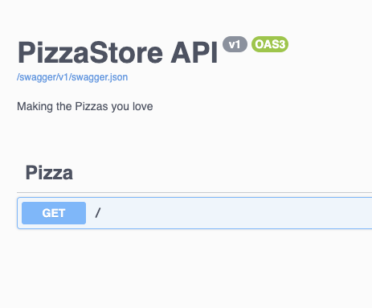
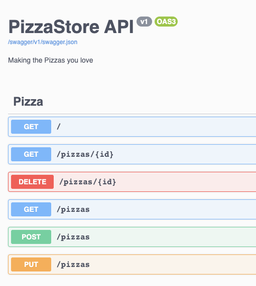

# Build an HTTP backend with Minimal APIs

## What is an HTTP API?

Web servers are often used to serve web pages, but they can also be used to serve other types of data. For example, a web server can be used to provide data for other clients, such as a mobile app, a desktop app, another web server. Sometimes, we'll use front-end single page applications (SPAs) like Angular or React in the browser, but they'll interact with data on the server behind the scenes. Services like these are "Application Programming Interfaces" (APIs), rather than user interfaces like web browsers.

### HTTP: the instruction set for web APIs

Suppose the server has a list of pizzas that you want to interact with from your client program. There are some really common things you’ll want to do with a list of data (pizzas in this case) as a programmer:

- Get a list of all the pizzas
- Get the details about one pizza
- Add a new pizza to the list
- Update the details for a pizza
- Remove a pizza from the list

Because these things are so common, the web was designed with standard commands to handle them: GET, PUT, POST, and DELETE. These are part of the HTTP (short for HyperText Transport Protocol) specification, so anyone building a browser or server knows what to expect. Programmers build APIs for all kinds of things, from operating systems to smart watches to refrigerators, so we often talk about web focused APIs as HTTP APIs.

### Serialization data with JSON

To avoid reinventing things over and over, we use some common standards for HTTP APIs. We’ve already talked about HTTP, which handles the commands and communication between clients and servers. Another important thing for HTTP APIs to do in a predictable way is to send data back and forth. The most common way to package up data now is called JSON, short for JavaScript Object Notation. It’s a neat, simple format for packaging up data, but programmers don’t want to spend time converting their information back and forth between properties and classes in their programming language  and JSON. This conversion process is called serialization, and fortunately ASP.NET Core can do that for you automatically.

### Welcome to the internet...

Another important thing to think about for server exposed to the public internet is security and authorization. Some HTTP APIs require authentication, so only clients with the right credentials can access them. Even public HTTP APIs need to handle security, to manage things like denial of service attacks and exploiting the public APIs to take over the server or get access to information they shouldn’t have. Fortunately, ASP.NET Core can handle things like this for us, too.

## Keep it simple with Minimal APIs

By now, you might be thinking that building an API that speaks HTTP, serializes JSON, manages security, etc., is going to be really hard! Fortunately, ASP.NET Core has a really easy way to get started, called Minimal APIs. Believe it or not, this is all you need to build a basic Minimal API:

```csharp
var builder = WebApplication.CreateBuilder(args);
var app = builder.Build();
app.MapGet("/", () => "Hello World!");
app.Run();
```

The first two lines set up the server, the third line returns some information (in this case “Hello World!”), and the fourth line runs it. That third line is called an endpoint, and it just says that whenever a client sends a GET command to our server, it will run some code. We have similar commands for all the other HTTP verbs, so creating a new Pizza on the server would look like this:

```csharp
app.MapPost("/pizzas", (Pizza pizza) => PizzaDB.CreatePizza(pizza));
```

This endpoint accepts a pizza JSON object, turns it into C#, and passes it to a PizzaDB class to save it to a database.

## Building a Minimal API

### Create a new Minimal API project

First, you need to scaffold a project. You've installed .NET 6 and you're ready to go.

1. Create a web API by running `dotnet new`:

   ```bash
   dotnet new web -o PizzaStore
   ```

   You should see the _PizzaStore_ directory.

1. Run the app by calling `dotnet run`. It builds the app and hosts it on a port from 5000 to 5300. HTTPS has a port selected for it in the range of 7000 to 7300.

   ```bash
   dotnet run
   ```

   Here's what the output can look like in the terminal:

   ```output
   Building...
    info: Microsoft.Hosting.Lifetime[14]
          Now listening on: https://localhost:7200
    info: Microsoft.Hosting.Lifetime[14]
          Now listening on: http://localhost:5100
    info: Microsoft.Hosting.Lifetime[0]
          Application started. Press Ctrl+C to shut down.
    info: Microsoft.Hosting.Lifetime[0]
          Hosting environment: Development
    info: Microsoft.Hosting.Lifetime[0]
          Content root path: /<path>/PizzaStore
   ```

1. In your browser, go to the indicated port. According to the terminal `http://localhost:{PORT}`, you should see the text "Hello World!"

Congratulations! You've created an API by using a minimal API template.

## Add automatic API documentation with Swagger

Use Swagger to ensure that you have a self-documenting API, where the docs change when you change the code. This also builds a really convenient web interface for your API, so you can test out the application as you build it.

1. Install the *Swashbuckle* package:

    ```bash
    dotnet add package Swashbuckle.AspNetCore
    ```

1. Next, configure your project to use Swagger. Open _Program.cs_ and add replace it with the following code:

    ```csharp
    using Microsoft.OpenApi.Models;
    
    var builder = WebApplication.CreateBuilder(args);
        
    builder.Services.AddEndpointsApiExplorer();
    builder.Services.AddSwaggerGen(c =>
    {
         c.SwaggerDoc("v1", new OpenApiInfo { Title = "PizzaStore API", Description = "Making the Pizzas you love", Version = "v1" });
    });
        
    var app = builder.Build();
        
    if (app.Environment.IsDevelopment())
    {
         app.UseDeveloperExceptionPage();
    }
        
    app.UseSwagger();
    app.UseSwaggerUI(c =>
    {
       c.SwaggerEndpoint("/swagger/v1/swagger.json", "PizzaStore API V1");
    });
        
    app.MapGet("/", () => "Hello World!");
        
    app.Run();
    ```

    This is actually just adding a few lines of code:

    - The `using` statement at the top makes it easier to use the *Swashbuckle* package without having to type out long namespaces for the commands.
    - The two `builder.Services.Add` lines add the two services that *Swashbuckle* needs to generate the documentation.
    - The `UseSwagger` and `UseSwaggerUI` lines add the Swagger and Swagger UI endpoints.

1. Rerun the project and go to the app's address, `http://localhost:{PORT}/swagger`.

   You should see the following output:

    

### Add a Pizza model and service

First you need some data. To store and manage data, you'll use an in-memory store. For this example, we're just going to use a simple list of pizzas. Don't worry too much about this pizza service, it's just a quick example that holds a list of pizzas so we our API has some data to work with.

1. Create the file _Db.cs_ and give it the following content:

   ```csharp
    namespace PizzaStore.DB; 

    public record Pizza 
    {
      public int Id {get; set;} 
      public string ? Name { get; set; }
    }

    public class PizzaDB
    {
      private static List<Pizza> _pizzas = new List<Pizza>()
      {
        new Pizza{ Id=1, Name="Cheese" },
        new Pizza{ Id=2, Name="Pepperoni" },
        new Pizza{ Id=3, Name="Pineapple extravaganza"} 
      };

      public static List<Pizza> GetPizzas() 
      {
        return _pizzas;
      } 

      public static Pizza ? GetPizza(int id) 
      {
        return _pizzas.SingleOrDefault(pizza => pizza.Id == id);
      } 

      public static Pizza CreatePizza(Pizza pizza) 
      {
        _pizzas.Add(pizza);
        return pizza;
      }
    
      public static Pizza UpdatePizza(Pizza update) 
      {
        _pizzas = _pizzas.Select(pizza =>
        {
          if (pizza.Id == update.Id)
          {
            pizza.Name = update.Name;
          }
          return pizza;
        }).ToList();
        return update;
      }

      public static void RemovePizza(int id)
      {
        _pizzas = _pizzas.FindAll(pizza => pizza.Id != id).ToList();
      }
    }
   ```

Now that you have your data store, let's have the API use it next.

### Connect data to routes

To connect your in-memory store to the API:

1. **Add the namespace.** This addition is as simple as adding the proper `using` statement.
1. **Set up the routes.** Make sure you add all the route mappings that are needed to create, read, update, and delete.
1. **Invoke it in the routes.** Finally, you need to call the in-memory store per each route and pass in any parameters or body from the request, if applicable.

Now, connect data in your API.

1. At the top of the _Program.cs_ file, add the following line of code:

   ```csharp
   using PizzaStore.DB;
   ```

1. Just before `app.Run()`, add the following code:

   ```csharp
   app.MapGet("/pizzas/{id}", (int id) => PizzaDB.GetPizza(id));
   app.MapGet("/pizzas", () => PizzaDB.GetPizzas());
   app.MapPost("/pizzas", (Pizza pizza) => PizzaDB.CreatePizza(pizza));
   app.MapPut("/pizzas", (Pizza pizza) => PizzaDB.UpdatePizza(pizza));
   app.MapDelete("/pizzas/{id}", (int id) => PizzaDB.RemovePizza(id));
   ```

    This is the actual API part of the application! As you can see, there's not a lot of code. We're just mapping the routes to code that calls into our in-memory store.

1. Run the app by using `dotnet run`:

   ```bash
   dotnet run
   ```

1. In your browser, go to `http://localhost:{PORT}/swagger`.

   You should see the following page rendering:

    

    What's great about this Swagger UI is that you can use it to test out the API. Click on any of the API endpoints to expand it, and click the `Try it out` button. You'll see a form that makes it easy to try submitting requests to the API and seeing the response.

## What's next?

This is a quick first look at building a backend with Minimal APIs. To go through this same example in more detail, and with more explanation, check out the [Minimal API learning path on Microsoft Learn](https://docs.microsoft.com/learn/paths/aspnet-core-minimal-api/)!

In the next lesson, you'll learn about building a game with Blazor! Stay tuned!
