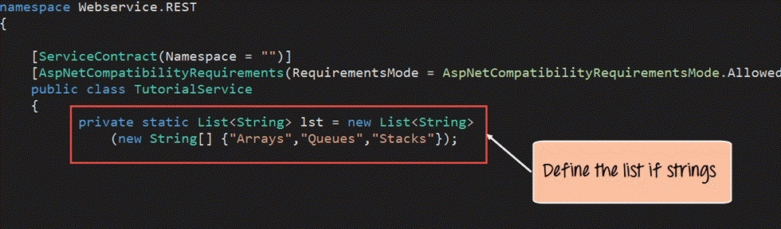
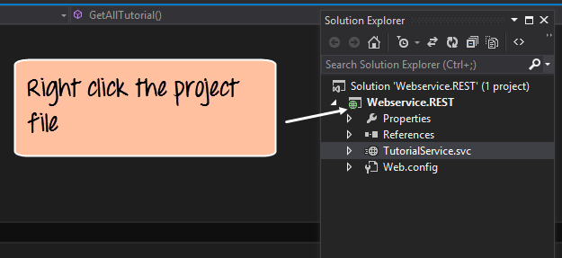

RESTful Web Services Tutorial: What is REST API with Example
============================================================

By[Abhilash Panicker](https://dbugr.netlify.app)

What is Restful Web Services?
-----------------------------

**Restful Web Services** is a lightweight, maintainable, and scalable service that is built on the REST architecture. Restful Web Service, expose API from your application in a secure, uniform, stateless manner to the calling client. The calling client can perform predefined operations using the Restful service. The underlying protocol for REST is HTTP. REST stands for REpresentational State Transfer.

In this REST API tutorial, you will learn-

*   [RESTful Key Elements](restful-web-services.md#restful-key-elements)
*   [Restful Methods](restful-web-services.md#restful-methods)
*   [Why Restful](restful-web-services.md#why-restful)
*   [Restful Architecture](restful-web-services.md#restful-architecture)
*   [RestFul Principles and Constraints](restful-web-services.md#restFul-principles-and-constraints)
*   [Create your first Restful web service in ASP.NET](restful-web-services.md#create-your-first-restful-web-service)
*   [Running your first Restful web service](restful-web-services.md#running-your-first-restful-web-service)
*   [Testing your first Restful web service](restful-web-services.md#testing-your-first-restful-web-service)

RESTful Key Elements
--------------------

REST Web services have really come a long way since its inception. In 2002, the Web consortium had released the definition of WSDL and SOAP web services. This formed the standard of how web services are implemented.

In 2004, the web consortium also released the definition of an additional standard called RESTful. Over the past couple of years, this standard has become quite popular. And is being used by many of the popular websites around the world which include Facebook and Twitter.

REST is a way to access resources which lie in a particular environment. For example, you could have a server that could be hosting important documents or pictures or videos. All of these are an example of resources. If a client, say a web browser needs any of these resources, it has to send a request to the server to access these resources. Now REST services defines a way on how these resources can be accessed.  

The key elements of a RESTful implementation are as follows:

1.  **Resources** – The first key element is the resource itself. Let assume that a web application on a server has records of several employees. Let’s assume the URL of the web application is **http://demo.dbugr.com**. Now in order to access an employee record resource via REST services, one can issue the command **http://demo.dbugr.com/employee/1** – This command tells the web server to please provide the details of the employee whose employee number is 1.
2.  **Request Verbs** – These describe what you want to do with the resource. A browser issues a GET verb to instruct the endpoint it wants to get data. However, there are many other verbs available including things like POST, PUT, and DELETE. So in the case of the example **http://demo.dbugr.com/employee/1** , the web browser is actually issuing a GET Verb because it wants to get the details of the employee record.
3.  **Request Headers** – These are additional instructions sent with the request. These might define the type of response required or the authorization details.
4.  **Request Body** – Data is sent with the request. Data is normally sent in the request when a POST request is made to the REST web services. In a POST call, the client actually tells the REST web services that it wants to add a resource to the server. Hence, the request body would have the details of the resource which is required to be added to the server.
5.  **Response Body** – This is the main body of the response. So in our RESTful API example, if we were to query the web server via the request **http://demo.dbugr.com/employee/1** , the web server might return an XML document with all the details of the employee in the Response Body.
6.  **Response Status codes** – These codes are the general codes which are returned along with the response from the web server. An example is the code 200 which is normally returned if there is no error when returning a response to the client.

Restful Methods
---------------

The below diagram shows mostly all the verbs (POST, GET, PUT, and DELETE) and an REST API example of what they would mean.

Let’s assume that we have a RESTful web service is defined at the location. **http://demo.dbugr.com/employee** . When the client makes any request to this web service, it can specify any of the normal HTTP verbs of GET, POST, DELETE and PUT. Below is what would happen If the respective verbs were sent by the client.

1.  **POST** – This would be used to create a new employee using the RESTful web service
2.  **GET** – This would be used to get a list of all employee using the RESTful web service
3.  **PUT** – This would be used to update all employee using the RESTful web service
4.  **DELETE** – This would be used to delete all employee using the RESTful services

Let’s take a look from a perspective of just a single record. Let’s say there was an employee record with the employee number of 1.  
  
The following actions would have their respective meanings.

1.  **POST** – This would not be applicable since we are fetching data of employee 1 which is already created.
2.  **GET** – This would be used to get the details of the employee with Employee no as 1 using the RESTful web service
3.  **PUT** – This would be used to update the details of the employee with Employee no as 1 using the RESTful web service
4.  **DELETE** – This is used to delete the details of the employee with Employee no as 1

Why Restful
-----------

Restful mostly came into popularity due to the following reasons:

**1\. Heterogeneous languages and environments** – This is one of the fundamental reasons which is the same as we have seen for SOAP as well.

*   It enables web applications that are built on various programming languages to communicate with each other
*   With the help of Restful services, these web applications can reside on different environments, some could be on Windows, and others could be on Linux.

But in the end, no matter what the environment is, the end result should always be the same that they should be able to talk to each other. Restful web services offer this flexibility to applications built on various programming languages and platforms to talk to each other.

The below picture gives an example of a web application which has a requirement to talk to other applications such Facebook, Twitter, and Google.

Now if a client application had to work with sites such as Facebook, Twitter, etc. they would probably have to know what is the language Facebook, Google and Twitter are built on, and also on what platform they are built on.

Based on this, we can write the interfacing code for our web application, but this could prove to be a nightmare.

Facebook, Twitter, and Google expose their functionality in the form of Restful web services. This allows any client application to call these web services via REST.

**2\. The event of Devices** – Nowadays, everything needs to work on Mobile devices, whether it be the mobile device, the notebooks, or even car systems.

Can you imagine the amount of effort to try and code applications on these devices to talk with normal web applications? Again Restful API’s can make this job simpler because as mentioned in point no 1, you really don’t need to know what is the underlying layer for the device.

**3\. Finally is the event of the Cloud** – Everything is moving to the cloud. Applications are slowly moving to cloud-based systems such as in Azure or Amazon. Azure and Amazon provide a lot of API’s based on the Restful architecture. Hence, applications now need to be developed in such a way that they are made compatible with the Cloud. So since all Cloud-based architectures work on the REST principle, it makes more sense for web services to be programmed on the REST services based architecture to make the best use of Cloud-based services.

Restful Architecture
--------------------

An application or architecture considered RESTful or REST-style has the following characteristics

**1\. State and functionality are divided into distributed resources** – This means that every resource should be accessible via the normal HTTP commands of GET, POST, PUT, or DELETE. So if someone wanted to get a file from a server, they should be able to issue the GET request and get the file. If they want to put a file on the server, they should be able to either issue the POST or PUT request. And finally, if they wanted to delete a file from the server, they can issue the DELETE request.

**2\. The architecture is client/server, stateless, layered, and supports caching**

*   Client-server is the typical architecture where the server can be the web server hosting the application, and the client can be as simple as the web browser.
*   Stateless means that the state of the application is not maintained in REST. For example, if you delete a resource from a server using the DELETE command, you cannot expect that delete information to be passed to the next request.

In order to ensure that the resource is deleted, you would need to issue the GET request. The GET request would be used to first get all the resources on the server. After which one would need to see if the resource was actually deleted.  

RESTFul Principles and Constraints
----------------------------------

The REST architecture is based on a few characteristics which are elaborated below. Any RESTful web service has to comply with the below characteristics in order for it to be called RESTful. These characteristics are also known as design principles which need to be followed when working with RESTful based services.

1.  **RESTFul Client-Server**
    
       

This is the most fundamental requirement of a REST based architecture. It means that the server will have a RESTful web service which would provide the required functionality to the client. The client send’s a request to the web service on the server. The server would either reject the request or comply and provide an adequate response to the client.

2.  **Stateless**

The concept of stateless means that it’s up to the client to ensure that all the required information is provided to the server. This is required so that server can process the response appropriately. The server should not maintain any sort of information between requests from the client. It’s a very simple independent question-answer sequence. The client asks a question, the server answers it appropriately. The client will ask another question. The server will not remember the previous question-answer scenario and will need to answer the new question independently.

3.  **Cache**

The Cache concept is to help with the problem of stateless which was described in the last point. Since each server client request is independent in nature, sometimes the client might ask the server for the same request again. This is even though it had already asked for it in the past. This request will go to the server, and the server will give a response. This increases the traffic across the network. The cache is a concept implemented on the client to store requests which have already been sent to the server. So if the same request is given by the client, instead of going to the server, it would go to the cache and get the required information. This saves the amount of to and fro network traffic from the client to the server.

4.  **Layered System**

The concept of a layered system is that any additional layer such as a middleware layer can be inserted between the client and the actual server hosting the RESTFul web service (The middleware layer is where all the business logic is created. This can be an extra service created with which the client could interact with before it makes a call to the web service.). But the introduction of this layer needs to be transparent so that it does not disturb the interaction between the client and the server.

5.  **Interface/Uniform Contract**

This is the underlying technique of how RESTful web services should work. RESTful basically works on the HTTP web layer and uses the below key verbs to work with resources on the server

*   POST – To create a resource on the server
*   GET – To retrieve a resource from the server
*   PUT – To change the state of a resource or to update it
*   DELETE – To remove or delete a resource from the server

Create your first Restful web service in ASP.NET
------------------------------------------------

Now in this REST API tutorial, we will learn how to create a Restful web service in ASP.NET:

Web services can be created in a variety of languages. Many integrated development environments can be used to create REST-based services.

In this RESTful API example, we are going to create our REST application in .Net using Visual Studio. In our example, for Restful web services we are going to emulate the following REST service example.

We are going to have a Restful web service which will work on the below set of data.

The below set of data represents an REST API example of having a company which exposes the Tutorial’s they have based on the Tutorialid.

|    Tutorialid          | TutorialName                 | 
| :-: | :------------------------------------------------------: | 
| 0 |    Arrays|
| 1 | Queueus |
| 2 | Stacks |

In our REST API tutorial example, we are going to implement the below Restful Verbs.

1.  **GET Tutorial** – When a client invokes this Restful API, they will be given the entire set of Tutorials available from the web service.
2.  **GET Tutorial/Tutorialid** – When a client invokes this Restful API, they will be given the Tutorial name based on the Tutorialid sent by the client.
3.  **POST Tutorial/Tutorialname** – When a client invokes this Restful API, the client will submit a request to insert a Tutorialname. The web service will then add the submitted Tutorial name to the collection.
4.  **DELETE Tutorial/Tutorialid**– When a client invokes this Restful API, the client will submit a request to delete a Tutorialname based on the Tutorialid. The web service will then delete the submitted Tutorial name from the collection.

Let’s follow the below steps in this RESTful API tutorial to create our first RESTful web services, which carries out the above implementation.

How to Create Your First Resful Web Service
-------------------------------------------

**Step 1)** Create new project.  
The first step is to create an empty Asp.Net Web application. From Visual Studio 2013, click on the menu option File->New project.

Once you click on the New Project option, Visual Studio will then give you another dialog box for choosing the type of project and to give the necessary details of the project. This is explained in the next step of this RESTful API tutorial

**Step 2)** Enter project name and location.

1.  Ensure to first choose the RESTful web services C# web template of ASP.NET Web application. The project has to be of this type in order to create web services project. By choosing this options, Visual Studio will then carry out the necessary steps to add required files which are required by any web-based application.
2.  Give a name for your project which in our case has been given as “Webservice.REST”.
3.  Then ensure to give a location, where the project files will be stored.

Once done you will see the project file created in your solution explorer in Visual Studio 2013.

**Step 3)** Create the web service file.  
The next step is to create the web service file which is going to have the RESTful web service

1.  First Right-click on the project file as shown below

2.  In this step,
    1.  Right-click on the project file
    2.  Choose the option “Add->new item.”

In the dialog box which appears, you need to perform the following

1.  Choose the option of WCF Service (Ajax-enabled) – Choose a file of this type, it causes the Visual studio to add some basic code which helps one create a RESTful web service. WCF stands for Windows Communication Foundation. WCF is a library for applications of various platforms or the same platform to communicate over the various protocols such as TCP, HTTP, HTTPS. Ajax basically is Asynchronous JavaScript and XML. AJAX allows web pages to be updated asynchronously by exchanging small amounts of data with the server behind the scenes.
2.  Next give a name for the service which is TutorialService in our case.
3.  Finally, click the Add button to add the service to the solution.

**Step 4)** Make a configuration.  
The next step is to actually make a configuration change to enable this project to complete work with RESTful web services. This requires to make a change to the file called **Web.config**. This file appears in the same window as the Webservice project file. The file Web.config contains all configurations that make the web application work as it should. The change being made actually allows the application to send and receive data as a pure RESTful web service.

1.  Click on the Web.config file to open the code

2.  Find for the line <enableWebScript>

3.  Change the line to <webHttp>

**Step 5)** Add our code for implementation.  
The next step in this RESTful API tutorial is to add our code for implementation. All of the below-mentioned code has to be written in the TutorialService.svc file

1.  The first bit is to add code to represent our data which will be used in our program. So we are going to have a list of string variables with values of “Arrays”, “Queues” and “Stacks”. This will represent the tutorials name available through our hosting web service.

namespace Webservice.REST
{
	\[ServiceContract(Namespace = "")\]
	\[AspNetCompatibilityRequirements(RequirementsMode = AspNetCompatibilityRequirementsMode.Allowed
	public class TutorialService
	{
		private static List<String> lst = new List<String>
		(new String\[\] {"Arrays","Queues","Stacks"});

**Step 6)** Define the code for our GET method.  
Next we will define the code for our GET method. This code will also reside in the same TutorialService.svc file. This code will run whenever we call the service from our browser.

The below method will be used to fulfill the below-mentioned scenario

*   If a user wants a list of all Tutorials available, then the below code would need to be written to accomplish this.

\[WebGet(UriTemplate="/Tutorial")\]

public String GetAllTutorial()
{
	int count = 1st.Count;
	String TutorialList = "";
	for (int i = 0; i < count; i++)
	TutorialList = TutorialList + lst\[i\] + ",";
	return TutorialList;
}

**Code Explanation:-**

1.  The first line of code is the most important. It is used to define how we can call this method via a URL. So if the link to our web service is **http://localhost:52645/TutorialService.svc** and if we append the ‘/Tutorial’ to the URL as **http://localhost:52645/TutorialService.svc/Tutorial** , the above code will be invoked. The attribute of ‘WebGet’ is a parameter which allows this method to be a RESTful method so that it can be invoked via the GET verb.
2.  This section of code is used to go through our list of strings in the ‘lst’ variable and return all of them to the calling program.

**Step 7)** Return the output.  
The code below ensures that if a GET call is made to the Tutorial Service with a Tutorial id, then it would return the corresponding Tutorial Name based on the Tutorial id.

\[WebGet (UriTemplate = "/Tutorial/{Tutorialid}")\]

public String GetTutorialbyID(String Tutorialid)
{
	int pid;
	Int32.TryParse(Tutorialid, out pid);
	return lst\[pid\];
}

**Code Explanation:-**

1.  The first line of code is the most important. It is used to define how we can call this method via a URL. So if the link to our web service is **http://localhost:52645/TutorialService.svc** and if we append the ‘/Tutorial/{Tutorialid}’ to the URL, then we would be able to call the web service as **http://localhost:52645/TutorialService.svc/Tutorial/1** as an example. The web service would then need to return the Tutorial name which had the Tutorial id#1.
2.  This section of code is used to return the “Tutorial name” which has the Tutorial id passed to the web method.

*   By default, what needs to be remembered is that whatever is passed to the URL in the browser is a string.
*   But you have to remember that the Index to our list has to be an integer, so we are adding the necessary code to first convert the Tutorialid to an Integer and then use it to access the index position in our list and
*   Then return the value to the calling program accordingly.

**Step 8)** Write the code for POST method.  
The next step is to write up the code for our POST method. This method will be invoked whenever we want to add a string value to our list of Tutorials via the POST method. For example, if you wanted to add the Tutorial name of “Software Testing” then you would need to use the POST method.

**Code Explanation:-**

1.  The first line is the ‘WebInvoke’ attribute which has been attached to our method. This allows the method to be invoked via the POST call. The RequestFormat and ResponseFormat attribute have to be mentioned as JSON, since when posting values to a RESTFul web service, the values have to be in this format.
2.  The second line of code is used to add the string value passed via the POST call to our existing list of Tutorial strings.

**Step 9)** Add method to handle the DELETE operation.  
Finally we are going to add our method to handle the DELETE operation. This method will be invoked whenever we want to delete an existing string value from our list of Tutorials via the DELETE method.

\[WebInvoke(Method = "DELETE", RequestFormat = WebMessageFormat.Json,
	UriTemplate = "/Tutorial/{Tutorialid}", ResponseFormat = WebMessageFormat.Json,
	BodyStyle = WebMessageBodyStyle.Wrapped)\]
	
public void DeleteTutorial(String Tutorialid)
{
	int pid;
	Int32.TryParse(Tutorialid, out pid);
	1st.RemoveAt(pid);
}

**Code Explanation:-**

1.  The first line is the ‘WebInvoke’ attribute which has been attached to our method. This allows the method to be invoked via the POST call. The RequestFormat and ResponseFormat attribute have to be mentioned as JSON, since when posting values to a RESTFul web service, the values have to be in this format. Note that the Method parameter is being set to “DELETE.” This means that whenever we issue the DELETE verb, this method will be invoked.
2.  The second line of code is used to take the Tutorialid sent via the DELETE call and subsequently delete that id from our list. (The **Int32** function in code is used to convert the Tutorial ID from a string variable to an integer).

Running your first Restful web service
--------------------------------------

Now that we have created our entire web service in the above section. Let’s see how we can run the Tutorial service so that it can be invoked from any client.

To run the web service, please follow the below steps

**Step 1)** Right click on the Project file – Webservice.REST

**Step 2)** Choose the menu option ‘Set as StartUp Project’. This will ensure that this project is run when Visual Studio runs the entire solution

**Step 3)** The next step is to run the project itself. Now depending on the default browser installed on the system, the appropriate browser name will come next to the run button in Visual Studio. In our case, we have Google Chrome showing up. Just click on this button.

**Output:-**

When the project is run, you can browse to your TutorialService.svc/Tutorial section, and you will get the below output.

In the above output,

*   You can see that the browser is invoking the ‘GET’ verb and executing the ‘GetAllTutorial’ method in the web service. This module is used to display all the Tutorials exposed by our web service.

Testing your first Restful web service
--------------------------------------

In the above section, we have already seen how to use the browser to execute the ‘GET’ verb and invoke the ‘GetAllTutorial.’

1.  Let’s now use the browser to execute the following use case scenario.

**GET Tutorial/Tutorialid – When a client invokes this Restful API, they will be given the Tutorial name based on the Tutorialid sent by the client**

In your browser, append the string /1 after the Tutorial word in the URL. If you hit the enter button, you will get the below output

Now you will see the output of Queues which actually corresponds to the number 1 in our list of Tutorial Strings. This means that the ‘GetTutorialbyID’ method is now being invoked from our Webservice. It also shows that the value of 1 is being passed successfully via the browser to our web service and to our method and that is why we are getting the correct corresponding value of “Queues” in the browser.

2.  Next let’s consume our web service by executing the below scenario. For this, you need to install the tool called “Fiddler” which is a free downloadable tool from the site.

**POST Tutorial/Tutorialname – When a client invokes this Restful API, the client will submit a request to insert a Tutorialname. The web service will then add the submitted Tutorial name to the collection.**

Run the Filddler tool and perform the below steps;

1.  Go to the composer section. This is used to create requests which can be submitted to any webapplication.
2.  Make sure the request type is “POST” and the correct URL is being hit, which in our case should be **http://localhost:52645/TutorialService.svc/Tutorial**
3.  Make sure the Content-Type is marked as application/json. Remember that our POST request method in our Web service only accepts json style data so we need to ensure this is specified when we are sending a request to our application.
4.  Finally, we need to enter our data. Remember that our method for POST accepts a parameter called ‘str.’ So here we are specifying that we want to add a value called “Trees” to our collection of Tutorial names and ensure that it is tagged to the str variable name.

Finally, just click the Execute button in fiddler. This will send a request to the web service to POST the data “Trees” to our web service.

Now, when we browse to the Tutorial URL to show all the strings in our Tutorial list, you will now see the value of “Trees” is also present. This shows that the POST request to the web service was successfully executed and that it was successfully added to our Tutorial List.

3.  Next let’s consume our web service by executing the below scenario. For this also we need to use the fiddler tool

**DELETE Tutorial/Tutorialid- When a client invokes this Restful API, the client will submit a request to delete a Tutorialname based on the Tutorialid. The web service will then delete the submitted Tutorial name from the collection.**

Run the Filddler tool and perform the below steps

1.  Go to the composer section. This is used to create requests which can be submitted to any webapplication.
2.  Make sure the request type is “DELETE” and the correct URL is being hit, which in our case should be **http://localhost:52645/TutorialService.svc/Tutorial**. Ensure that the id which is used to delete a string in the list sent via the URL as a parameter. In our REST example, we are sending 1 so this will delete the 2nd element in our collection which is “Queues”.

Finally, just click the Execute button in fiddler. This will send a request to the web service to DELETE the data “Queues” to our web service.

Now, when we browse to the Tutorial URL to show all the strings in our Tutorial list, you will notice that the value of “Queues” is no longer present.

This shows that the DELETE request to the web service was successfully executed. The element at index no 1 in our list of Tutorial strings was successfully deleted.

Summary
-------

*   REST stands for REpresentational State Transfer. REST is used to build web services that are lightweight, maintainable, and scalable in nature.
*   More and more applications are moving to the Restful architecture. This is because there are a lot of people now using mobile devices and a wider variety of applications moving to the cloud.
*   The main aspects of REST are the resources which reside on the server and the verbs of GET, POST, PUT and DELETE, which can be used to work with these resources.
*   Visual Studio and.Net can be used to create Restful web services.
*   When [Testing](https://www.tutorialsteacher.com/webapi/test-web-api) web services for POST and PUT, you need to use another tool called fiddler which can be used to send the POST and PUT request to the server.

